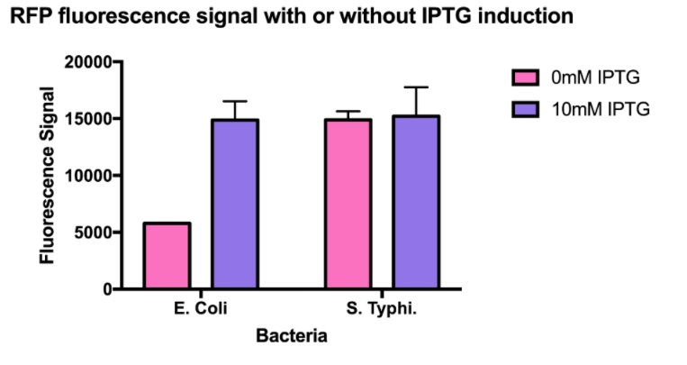

```{r}
no <- c(1)
team_name <- c("Team:Hong_Kong_HKU")
project_title <- c("Engineered Salmonella Typhimurium for enhanced drug delivery and cancer stem cell targeting")
project_year <- c(2019)
wiki_page <- c("https://2019.igem.org/Team:Hong_Kong_HKU")

igem_team <- data.frame(no, 
                        team_name, 
                        project_title, 
                        project_year, 
                        wiki_page)
#knitr::kable(std, format = "markdown")
knitr::kable(igem_team)
```


```{r}
no <- c(1, 2, 3, 4, 5, 6, 7, 8, 9, 10, 11, 12, 13, 14, 15, 16, 17, 18, 19, 20)

part_id <- c("BBa_K3063000", 
             "BBa_K3063010",
             "BBa_K3063011",
             "BBa_K3063012",
             "BBa_K3063020",
             "BBa_K3063021",
             "BBa_K3063022",
             "BBa_K3063030",
             "BBa_K3063031",
             "BBa_K3063040",
             "BBa_K3063041",
             "BBa_K3063011",
             "BBa_K3063900",
             "BBa_K3063901",
             "BBa_K3063902",
             "BBa_K3063903",
             "BBa_K3063904",
             "BBa_K3063905",
             "BBa_K3063934",
             "BBa_K3063987")
part_name <- c("flhDC transcription factors (Salmonella)", 
               "Strand 1 (free aptamer) for in vivo synthesis of DNA nanostructure", 
               "Strand 1 (AS1411) for in vivo synthesis of DNA nanostructure", 
               "Strand 1 (ST1) for in vivo synthesis of DNA nanostructure", 
               "Strand 2 (free aptamer) for in vivo synthesis of DNA nanostructure", 
               "Strand 2 (AS1411) for in vivo synthesis of DNA nanostructure", 
               "Strand 2 (33) for in vivo synthesis of DNA nanostructure", 
               "Strand 3 (free aptamer) for in vivo synthesis of DNA nanostructure", 
               "Strand 3 (AS1411) for in vivo synthesis of DNA nanostructure", 
               "Strand 4 (free aptamer) for in vivo synthesis of DNA nanostructure", 
               "Strand 4 (EpCam) for in vivo synthesis of DNA nanostructure", 
               "FlhDC transcriptions factors (Salmonella Typhimurium) with lac promoter", 
               "eSIBR casette with amiRNA insertion site (compatible with original eSIBR plasmid)", 
               "eSIBR construct fragment for STAT3", 
               "eSIBR construct fragment for SOX4", 
               "eSIBR construct fragment for SOX9	Ng ", 
               "eSIBR construct fragment for STAT3 and SOX4", 
               "eSIBR construct fragment for STAT3, SOX4 and SOX9",
               "GFP-eSIBR cassette with STAT3 SOX4 SOX9 amiRNA construct",
               "eSIBR casette with amiRNA insertion site")
part_type <- c("Coding", 
               "Other", 
               "Other", 
               "Other", 
               "Other", 
               "Other", 
               "Other", 
               "Other", 
               "Other", 
               "Other", 
               "Other", 
               "Coding", 
               "DNA", 
               "RNA", 
               "RNA", 
               "RNA", 
               "RNA", 
               "RNA",
               "Coding",
               "Coding")
team_id <- c(1, 1, 1, 1, 1, 1, 1, 1, 1, 1, 1, 1, 1, 1, 1, 1, 1, 1, 1, 1)

igem_part <- data.frame(no,
                        part_id, 
                        part_name,
                        part_type, 
                        team_id)

knitr::kable(igem_part)

```


```{r}
no <- c(1, 2, 3)
Circuit_name <- c("Nano Drug Carrier (NDC) w/ multiple aptamers (NDC-MA) for dual tumour-specific drug delivery system in Salmonella Typhimurium",
                  "Flagella Production Boost",
                  "Artificial miRNA silencing cassette")
Circuit_component <- c("J23100_Aptamer_Componentstrand_HTBS_B0054",
                       "J04500_flhDC_B0054",
                       "pCMV_T7_eGFP_STAT3_SOX4_SOX9_B0054_PolyA")
Construction_method <- c("Goldengate_assembly", "Goldengate_assembly", "Goldengate_assembly")

igem_circuit <- data.frame(no, 
                        Circuit_name, 
                        Circuit_component, 
                        Construction_method)
#knitr::kable(std, format = "markdown")
knitr::kable(igem_circuit)
```
```{r}
id <- c(1:4)
BBid <- c("BBa_R0010", "BBa_B0034", "BBa_E1010", "BBa_B0054")
type <- c("Promoter", "RBS", "RFP", "Terminator")
link <- c("http://parts.igem.org/Part:BBa_R0010",
           "http://parts.igem.org/Part:BBa_B0034",
           "http://parts.igem.org/Part:BBa_E1010",
           "http://parts.igem.org/Part:BBa_B0054")
device_id <- paste0("D", sprintf("%04d", rep(1, length(id))) )
team_name <- rep("Hong_Kong_HKU", length(id))
user <- rep("th-kim310", length(id))

igem_part <- data.frame(id, BBid, type, link, device_id, team_name, user)
#knitr::kable(igem_part)
igem_part
```


```{r}
id <- c(1:4)
strain <- c("E.coli", "E.coli", "S.Typhi", "S.Typhi")
indc <- rep("IPTG", length(id))
conc <- c(0, 10, 0, 10)
value <- c(5000, 15000, 15000, 15000)
valunit <- rep("Fluorescence", length(id))
incubhr <- rep("-", length(id))
incubtemp <- rep("-", length(id))
device_id <- rep("D0001", length(id))
link <- c("https://2019.igem.org/Team:Hong_Kong_HKU/Characterization",
           "https://2019.igem.org/Team:Hong_Kong_HKU/Characterization",
           "https://2019.igem.org/Team:Hong_Kong_HKU/Characterization",
           "https://2019.igem.org/Team:Hong_Kong_HKU/Characterization")


igem_obs <- data.frame(id, strain, indc, conc, value,
                        valunit, incubhr, incubtemp,
                       device_id, link)
#knitr::kable(igem_obs)
igem_obs

```
{width=50%}